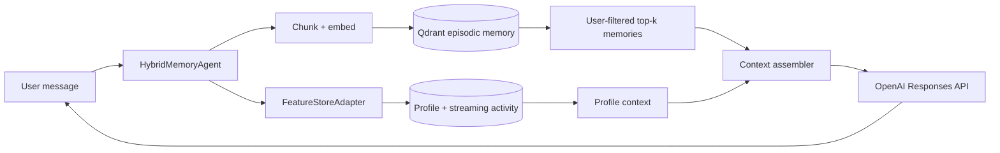

# Hybrid Memory Assistant — Architecture

**Contributors:** Hoàng Quang Minh (solo)

## Goal

This POC is a Vietnamese personal assistant with two deliberately different
memory systems. Episodic memory stores things the user said or read and is
retrieved by meaning. The stable profile stores compact, operational facts
such as language, reading speed, topic affinity, and recent query activity.
The language model only sees the assembled, user-scoped context; it is not the
source of truth for either memory.

## Decision 1 — chunking

The POC splits a remembered item into paragraphs and then caps each chunk at
roughly 120 words, retaining a small overlap. A per-message chunk is cheap and
keeps provenance simple, but a long pasted article would become one poor
vector; a whole-conversation chunk preserves narrative but exceeds the useful
retrieval granularity. Semantic chunking would improve boundaries, especially
for Vietnamese prose, but adds another model and makes ingestion less
predictable. The chosen cap is a practical middle ground: enough context for a
claim, small enough for top-3 retrieval and a final context window. Production
would store `conversation_id`, timestamps, source, and chunk ordinal so a
consolidation job could merge or delete related chunks.

## Decision 2 — feature schema

The feature adapter exposes `preferred_language`, `reading_speed_wpm`,
`topic_affinity`, `active_hours`, `queries_last_hour`, and
`distinct_topics_24h`. The entity is `user_id`; stable profile values have a
30-day TTL and activity values have a one-hour TTL. In the full lab these map
to the Feast user profile and query velocity views, with Parquet/Postgres as
the offline source and SQLite/Redis as the online source.

I chose tabular features for serving and kept embeddings in Qdrant. A profile
lookup should be deterministic, cheap, and inspectable (“the user prefers
cloud”), while a latent preference vector is better suited to ranking a large
memory collection. Storing both in one feature view would blur TTLs and make
point-in-time training joins harder to reason about.

## Decision 3 — freshness

There are three freshness budgets. A newly saved note is pushed to Qdrant
immediately, so a query about that note reflects it in sub-second to a few
seconds. Stable profile changes can refresh every five minutes in a batch
pipeline; a user changing language or reading speed does not need a streaming
path. Query velocity is updated on every request (or through a streaming
Push API in production), because “what am I focused on now?” has a one-hour
meaning and stale values are actively misleading. This is the same semantic
split as the lab’s Feast TTLs, not merely a performance preference.

## Rejected alternative

I considered putting episodic embeddings into Feast as an embedding feature.
That would give one serving interface, but it couples high-churn memory writes
to profile materialization and loses the vector store’s ANN filtering and
deletion workflow. I therefore keep episodic memory in Qdrant and use Feast
for stable, point-in-time-safe features. I also reject an unfiltered global
vector search: `user_id` is a mandatory payload filter, otherwise a similar
question can leak another person’s private note.

## Vietnamese and privacy considerations

The corpus can code-switch (`cloud`, `autoscaling`, and Vietnamese in one
sentence), so the POC uses the project’s pluggable embedding backend and does
not translate text before storage. Whitespace tokenization is acceptable for
the baseline but Vietnamese word segmentation (underthesea or pyvi), typo
normalization, and diacritic-tolerant aliases should be evaluated before
production. Tenant/user filters are applied inside the vector query, not after
retrieval. A real deployment also needs encryption at rest, deletion/export
controls, audit logs, consent, and a review of Vietnamese personal-data
requirements (including Decree 13). Memory text should never be logged with
API keys or raw secrets.

## Limitations and next steps

This POC has no multi-device conflict resolution, encrypted per-user keys,
automatic memory forgetting, or robust CRUD UI. Profile values are an adapter
rather than a live Feast connection in the default demo. Next steps are
semantic deduplication, memory decay/consolidation, a real streaming feature
writer, and evaluations for retrieval precision plus privacy isolation.

The final answer path uses the official OpenAI Python client and the Responses
API when a key is available; if the request fails, the assembled context is
still returned so memory behavior remains inspectable.
